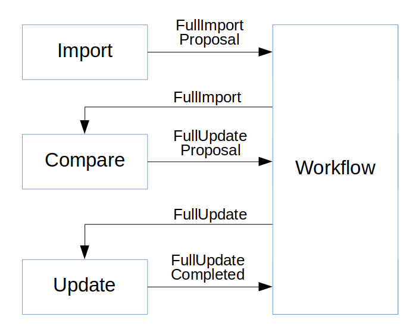

# GOB-Upload

GOB Upload data from import client to GOB

Uploading data consists of a comparing and storing the new data.

Each step is triggered by a message that is received from the message broker:

Importing data is not part of this project. It is only shown for completeness.
It is handled by the [GOB Import Client](https://github.com/Amsterdam/GOB-Import-Client-Template) project.

## Create updates by comparing imported data with current data

A **FullImport** message triggers the process that compares the imported data with the actual GOB data.
When finished the process will publish the result as a **FullUpload.Proposal** message

## Determine next step

The workflow component will evaluate the **FullUpload.Proposal** message.
If the contents is considered OK then the message will be republished as a **FullUpload** message.
If the contents is considered not OK (eg: >10% DELETES) then it will be held for manual approval before any further processing.

## Process the updates (ADD, CHANGE, DELETE, CONFIRM)

A **FullUpload** message triggers the process that registers the updates in the database and updates the models.
When finished the process will publish its resuls as a **FullUpload.Completed** message
